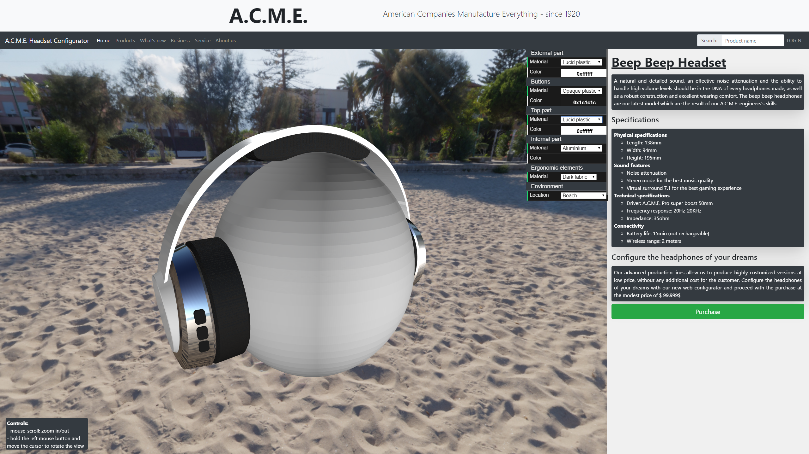
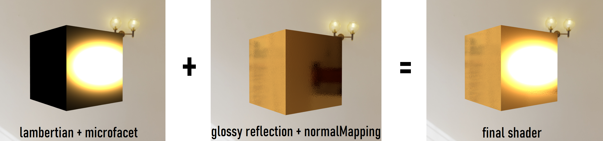
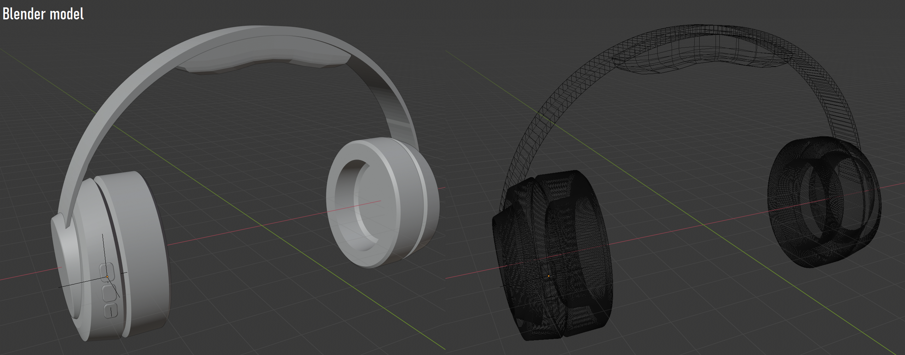

### About (ENG)
In this repo you can find a real-time web project developed via the Three.js library. This project has been developed for the university "Interactive 3D graphics" course. The course is about basic principles of real-time-rendering.

The assignement asked to develop an HTML online website with a 3D real-time configurator environrment.

The README is in italian language, as required by the course assignement, sorry for that.
---
# Product configurator - Andrea Mansi - 137857 - Università degli Studi di Udine - Italy
### 2° progetto Interactive 3D Graphics 2019-2020

---
---
## Descrizione del progetto:
Il seguente progetto propone un configuratore web che permette all'utente di personalizzare l'aspetto di un prodotto in vendita.

Il progetto consiste in una pagina web (simil e-commerce) che include un ambiente real-time (in WebGL) che visualizza il prodotto composto da vari materiali modellati tramite equazioni PBR, personalizzabili dall'utente tramite una GUI.

Il prodotto in questione è un paio di cuffie wireless composte da 5 parti (ciascuna di esse può avere un materiale diverso) modellato tramite il software di modellazione Blender.

### >> Segue uno screenshoot del risultato finale (una ipotetica configurazione dell'utente):

# Materiali:
La gamma di materiali proposti all'utente è la seguente: 
- plastica di qualsiasi colore (opaca e lucida)
- metalli: oro, argenti, alluminio e rame
- tessuto e pelle (entrambi in versione chiara e scura)

I materiali sono modellati tramite una BRDF che tiene in considerazione:
- L'illuminazione di 3 luci posizionate per illuminare l'oggetto (componente speculare e diffusiva tramite brdf lambertiana+microfacet)(il cui effetto si può notare sul manichino, non influenzato dalla envMap)
- L'illuminazione della cubemap tramite lo shader glossy reflection mapping.
- Normal mapping: ad ogni materiale è anche associata una normal Map per alterare (solo visivamente) la geometria dell'oggetto.

Lo shader si basa sul codice degli esempi del corso, i cui comportamenti sono stati uniti per ottenere il risultato finale. 

### >> Il seguente screen mostra come le due componenti contribuiscano al risultato finale (materiale utilizzato come esempio: oro):

### >> Segue invece uno screenshot che mostra come i metalli disponibili reagiscano a diverse ambientazioni:

  
# Il modello:
Il modello è composto da 5 parti diverse, modificabili a piacimento dall'utente scegliendo il matariale che desidera tra quelli disponibili. Il modello 3D è stato creato personalmente tramite Blender ed esportato in formato .gltf e successivamente importato tramite gltf loader.

Il codice assegna i vari materiali al modello andendo ad agire sui singoli mesh (5 in totale) alterandone il materiale o aggiornando le uniforms mentre l'utente interagisce con la GUI (ad esempio aggiornare la cubemap quando l'utente cambia ambientazione)

n° di vertici: circa 26k

# Alcuni render:

# Strumenti utilizzati

Per la parte real-time interattiva è stato utilizzato WebGL (THREE.js)
Per la fase di modellazione è stato utilizzato Blender
Per la creazione del sito web è stato utilizzato Bootstrap

NormalMaps e cubeMaps sono state scaricate da siti di distribuzione gratuita (ad esempio: https://hdrihaven.com/)

